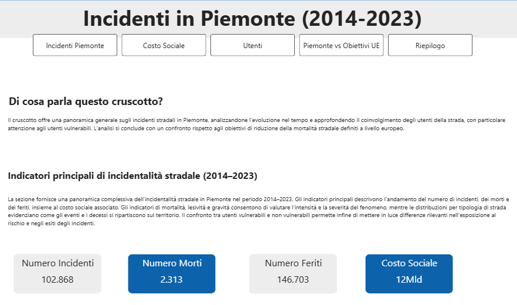
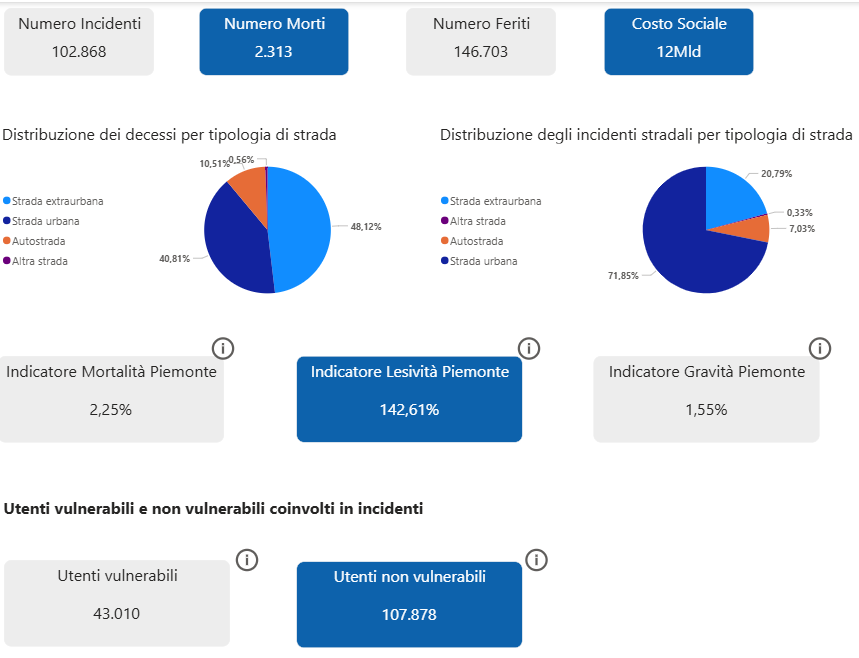
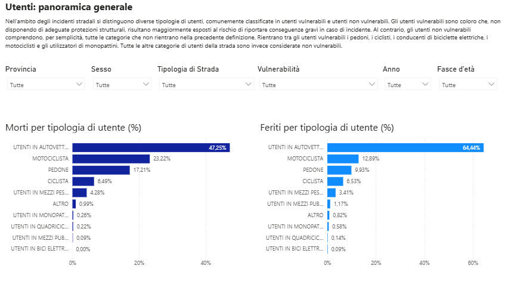
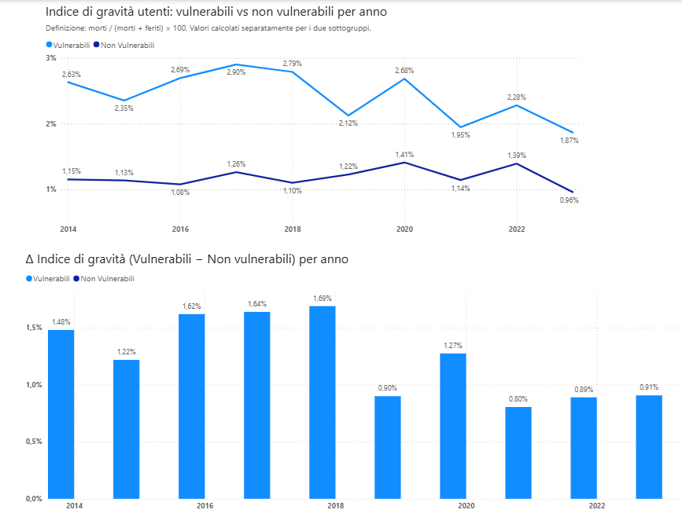
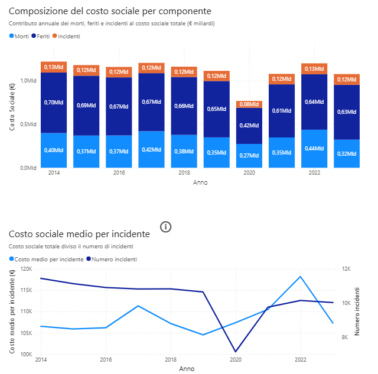
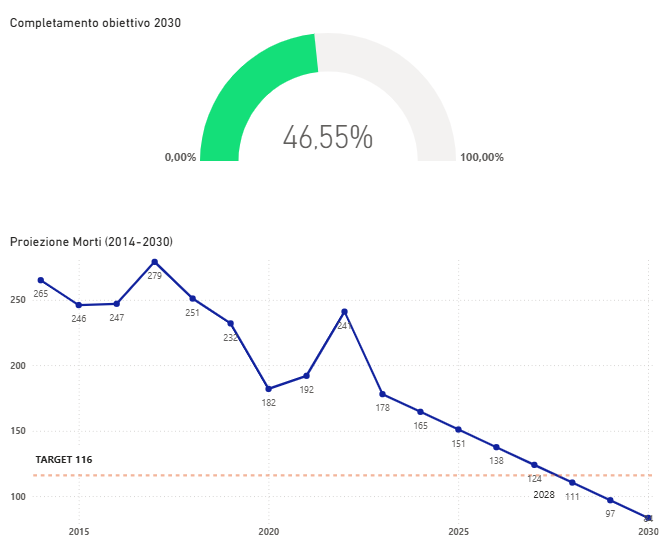

# road-safety-piedmont-2014-2023
Analisi dell'incidentalità stradale in Piemonte (2014–2023). Focus su utenti vulnerabili, indicatori di mortalità e gravità, e monitoraggio degli obiettivi europei Vision Zero 2030. Dati ISTAT elaborati con Power BI. Sviluppato nell'ambito del tirocinio presso CSI Piemonte (progetto PISTA).

# Analisi dell'incidentalità stradale in Piemonte (2014–2023)

Tesi di Master in **Analisi Dati per la Business Intelligence**  
Università degli Studi — A.A. 2024/2025  
**Studente:** Meli Simone | **Relatrice:** Prof.ssa Bonello Giuliana

---

## Descrizione

Questo repository contiene la presentazione della tesi di master sull'analisi della sicurezza stradale in Piemonte nel decennio 2014–2023, con focus sugli utenti vulnerabili e sul monitoraggio degli obiettivi europei **Vision Zero**.

L'analisi è stata svolta nell'ambito del tirocinio curriculare presso **CSI Piemonte**, e i risultati sono destinati ad alimentare il progetto **PISTA** (Piattaforma Integrata per la Sicurezza del Traffico e l'Analisi dell'incidentalità).

---

## Dashboard Power BI

Le visualizzazioni seguenti sono state sviluppate in Power BI nell'ambito 
del tirocinio presso CSI Piemonte e integrate nella piattaforma regionale 
**PISTA** (Piattaforma Integrata per la Sicurezza del Traffico e 
l'Analisi dell'incidentalità).

> Il file `.pbix` non è pubblicato per vincoli sui dati istituzionali della PA.

---

### Homepage e KPI principali

*KPI aggregati del decennio: 102.868 incidenti, 2.313 decessi, 
146.703 feriti, costo sociale stimato 12 miliardi di euro.*

---

### Panoramica indicatori — distribuzione per tipo di strada e utenti

*Distribuzione dei decessi per tipologia di strada (extraurbana 48% vs 
urbana 41%) e indicatori sintetici di mortalità, lesività e gravità.*

---

### Utenti: morti e feriti per tipologia

*Confronto tra la distribuzione dei morti e dei feriti per categoria 
di utente. I motociclisti rappresentano il 23% dei decessi.*

---

### Confronto indice di gravità: vulnerabili vs non vulnerabili

*L'indice di gravità degli utenti vulnerabili è costantemente il doppio 
rispetto agli utenti non vulnerabili nel periodo analizzato.*

---

### Costo sociale per componente (2014–2023)

*Scomposizione annuale del costo sociale in morti, feriti e incidenti. 
Il calo del 2020 riflette la riduzione della mobilità da Covid-19.*

---

### Trend mortalità e completamento obiettivo Vision Zero 2030

*Il Piemonte ha completato il 46,55% del percorso verso il target 
Vision Zero 2030 (−50% morti rispetto al 2019). Proiezione al 2030.*

---

## Struttura della presentazione

| Sezione | Contenuto |
|---|---|
| I – Panoramica | Indicatori aggregati regionali, morti e feriti per sesso, distribuzione per tipo di strada |
| II – Indicatori di sintesi | Costo sociale, indici di mortalità, lesività e gravità, trend temporali |
| III – Utenti vulnerabili | Definizione, mortalità per categoria, indice di gravità, confronto vulnerabili/non vulnerabili |
| IV – Vision Zero | Obiettivi europei 2030–2050, posizionamento del Piemonte, proiezione al 2030 |

---

## Principali risultati

- **102.868 incidenti**, **2.313 decessi**, **146.703 feriti** nel decennio
- Costo sociale totale stimato in circa **12 miliardi di euro**
- Mortalità in calo del **−32,8%** (da 265 morti nel 2014 a 178 nel 2023)
- Gli incidenti sono prevalentemente **urbani** (72%), ma la mortalità si concentra sulle strade **extraurbane** (48%)
- L'**indice di gravità** dei motociclisti (2,76%) e dei pedoni (2,66%) è circa il doppio della media regionale (1,55%)
- Il Piemonte ha completato il **46,55%** del percorso verso il target Vision Zero 2030 (−50% di morti rispetto al 2019)

---

## Fonte dei dati

**ISTAT** — Incidenti stradali con lesioni a persone, Piemonte, 2014–2023

---

## Strumenti utilizzati

- **Power BI** — analisi e visualizzazione dei dati
- Parametri di costo sociale: **Ministero delle Infrastrutture e dei Trasporti (MIT)**

---

## Contesto applicativo

I risultati dell'analisi sono integrati nel progetto **PISTA** di CSI Piemonte, fornendo:

1. Una baseline quantitativa dell'incidentalità regionale per il monitoraggio futuro
2. Identificazione di pattern e aree di criticità per orientare gli interventi
3. Quantificazione del differenziale di gravità tra utenti vulnerabili e non vulnerabili
4. Monitoraggio dello stato di avanzamento verso il target Vision Zero 2030

---

## Limiti dello studio

- Analisi di natura **descrittiva** su dati aggregati ISTAT (non consente valutazioni causali)
- Assenza di dati sull'**esposizione al rischio** (mobilità, traffico, km percorsi)
- Serie storica limitata per le categorie emergenti (monopattini, e-bike)
- Discontinuità metodologica nella stima del costo sociale (aggiornamento parametri MIT nel 2021)

---

## Licenza

Questo progetto è a scopo accademico. I dati utilizzati sono di fonte pubblica ISTAT.
